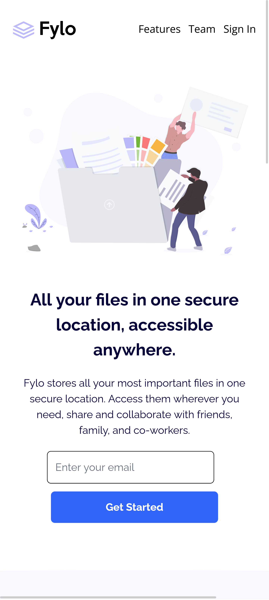

# Frontend Mentor - Fylo landing page with two column layout solution

This is a solution to the [Fylo landing page with two column layout challenge on Frontend Mentor](https://www.frontendmentor.io/challenges/fylo-landing-page-with-two-column-layout-5ca5ef041e82137ec91a50f5). Frontend Mentor challenges help you improve your coding skills by building realistic projects. 

## Table of contents

- [Overview](#overview)
  - [The challenge](#the-challenge)
  - [Screenshot](#screenshot)
  - [Links](#links)
- [My process](#my-process)
  - [Built with](#built-with)
  - [What I learned](#what-i-learned)
  - [Continued development](#continued-development)
  - [Useful resources](#useful-resources)
- [Author](#author)
- [Acknowledgments](#acknowledgments)

**Note: Delete this note and update the table of contents based on what sections you keep.**

## Overview

### The challenge

Users should be able to:

- View the optimal layout for the site depending on their device's screen size
- See hover states for all interactive elements on the page

### Screenshot

### Links

- Solution URL: [solution on GitHub here](https://github.com/primado/flyo-landing-page)
- Live Site URL: [Live site URL here](https://prima-fylo-site.netlify.app/)

## My process

### Built with

- Semantic HTML5 markup
- CSS custom properties
- Flexbox
- Tailwind CSS: [Tailwind CSS Docs](https://tailwindcss.com/)

### What I learned

This is my second time using Tailwind CSS for build a website. I started with Tailwind in the last week of December 2022. For this project particulary, I learned how to use Tailwind to build a responsive website. 

To see how you can add code snippets, see below:

### Continued development

I've started loving Tailwind CSS, for me, it easy to use and I will be using it in my future projects. Also there Docs is awesome. I will start building project that makes use of Grid layouts and other Tailwind concepts.
For now, I can build layouts with Tailwind CSS and will continue using it.

### Useful resources

- [Tailwind CSS Docs 1](https://tailwindcss.com) - The Tailwind CSS Docs was my go to resource for this project.

## Author

- Website - [Prince Adimado](https://github.com/primado)
- Frontend Mentor - [@primado](https://www.frontendmentor.io/profile/Prince-Adimado-105)
- Twitter - [@_primado_](https://www.twitter.com/_primado)

## Acknowledgments

For this project, I did everything by myself. Thank you

